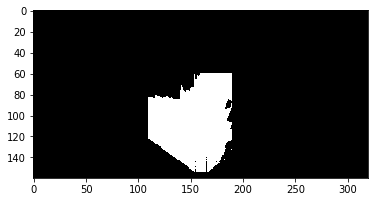

# Project: Search and Sample Return


This writeup decribe the process of, based on the structure provided [(refer to the project README.md)](README.md), modifying perception and decision procedures to make the rover navigate and pick up rocks autonomously. The following steps have been done.

* ## [Try the Simulator and Jupyter Notebook](#try-the-simulator-and-jupyter-notebook)
  - Run the simulator  
  - Test out the functions in the Jupyter Notebook
* ## [Autonomous Navigation and Mapping](#autonomous-navigation-and-mapping)
  - Fedelity improvement
  - `rock_pickup` mode
  - `stuck` mode
  - Steering angle in `stop` and `stuck` modes
* ## [The Result](#the-result)
* ## [Known Problems and Possible Future Improvements](#known-problems-and-possible-future-improvements)
  - Target rock behind the scatter rocks
  - Navigated terrain
  - After pick-up, turn left or right]
  - Hit the rock
  - Back to the start point

----

## Try the Simulator and Jupyter Notebook  
[(refer to the project README.md)](README.md)

### Run the simulator

- Download the simulator and take data in "Training Mode"

### Test out the functions in the Jupyter Notebook  
Inside the Jupyter Notebook, there are functions used for perception part of codes of the autonomous rover. They can be used for testing how the functions work.

- **Perspective view to world coordinates and rove steering angle**  
In order the generate rover's steering angle from the images from rover's camera, we use `perspective_transform()` to firstly change the viewing perspective to top view perspective, and then apply `color_thresh()` to identify the navigable terrain.  
  
  To obtain rover's steering angle, apply `rover_coords()` and `to_polar_coords()` respectively to get the angles of all navigable pixels and use the mean of them as steering angle.  
      
  
  Use `pix_to_world()`, for transfrom pixels in rover coordinates to world coordinates for later mapping teses pixels to world map.  

- **To find the rocks**  
  To identify the target rocks, use the same technique in `color_thresh()`, but with different threshold parameters. That is `find_rocks()`, of which the result as follows  
    

- **Generate the video**  
  Use the data gathered from simulator training mode and generate the video file required
  
## Autonomous Navigation and Mapping
I use the basic solution from [Project Walkthrough Video](https://www.youtube.com/watch?v=oJA6QHDPdQw), and do the following modifications

### Fedelity improvement  
After perspective transformation, the pixels at larger distance are not accurate, which affect the fedelity as a result. By simply using only pixels at a certain distance, we can increase the fedelity.   

Use only the center area (around an area of 100x80 in front of the rover, black out the other area). Compared with calculating the distance (circle or fan area, which makes better sense), using square area is less fancy, but is easy and does the job well(~80% fedelity).  


```python
    color_select[0:60,:] = 0
    color_select[:,0:110] = 0
    color_select[:,190:] = 0
```

### `rock_pickup` mode  
Through `find_rocks()`, once there is any rock found on rover's camera, switch `Romver.mode` to `rock-pickup`.  
In this mode, use the neareat point of rock to calculate the steering angle, and control throttle below 0.1 and velocity below 1m/s, for properly approaching the target rock. Once `Rover.near_sample == 1`, which means rover is near the rock, stop the rover and send pick-up command to rover, then switch back to `forward` mode to continue navigating.

### `stuck` mode  
Chances are that rove frequently get stuck in the terrain. Therefore, in either `forward` and `rock-pickup` mode, if rover's velocity is below 0.1 for 5 seconds, we consider the rover is stuck, and switch to `stuck` mode (record current mode for switch back later).  

In `stuck` mode, set throttle to -1, until velocity < -0.5 m/s (move the rover backward), and then switch back the originally mode.

### Steering angle in `stop` and `stuck` modes**  
Before switch to `stop` or `stuck` mode, use `ori-steering` to record current steering angle, and use the opposite direction of steering for better escaping strategy. If `ori-steer ==0`, use -15 as steering angle.

## The Result  
In simulator, resolution is set to "1366 X 768". Result might differs in different scenarios, but it is posibble to have > 90% terrain mapped, fidelity ~ 80%, and all 6 rocks found and picked-up.


## Known Problems and Possible Future Improvements
### Target rock behind the scatter rocks  
If the rover find a target rock, and it is on the other side of the cattered rocks in the middle of the terrain, the rover will move toward and will difinately get stuck in the rocks. In this case, even `stuck` mode is not helpful, because even the rover escaped from the stuck status, the rover will still move toward the scattered rocks and get stuck again, since that is the direction of target rock. A better aproach strategy in this kind of special scenario should be made.

### Navigated terrain  
For example, there are three main areas in the map, say A, B, and C. If we navigate the rover by detected navigable terrain, it might happen that the rover go to A first, then B area, and at the turning point go back to A again, and B, A, B, A.... As a result, C area will naver be navigated. If we can weighted more on non-navigated area when deciding the navigating direction, we can make sure new area get higher chances to be navigated.

### After pick-up turn left or right  
After picking up a rock, under the circumstance that there is no navigable terrain for judging the direction(rover facing obstacle), and current steer angle is 0 (we can turn the steer to opposite direction if it is not 0), we can only make rover turn to a fixed angle, in this case, -15. However, this might make rover move toward the opposite of its original direction before it find the rock.
  
### Hit the rock
It might happen that the rover could get stuck or hit scattered obstacle rocks in the terrain. Sometimes it get stuck so seriously that `stuck` mode cannot help. To avoid this, it should be possible to detectd these scattered obstacles and move around them.

### Back to the start point
After having picked up all 6 rocks, the way to navigate the rover back to the start point.


